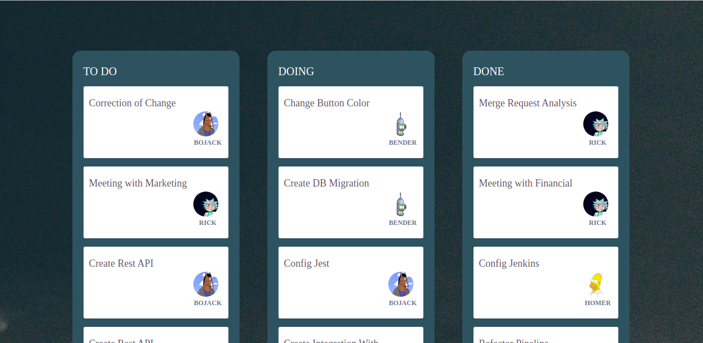
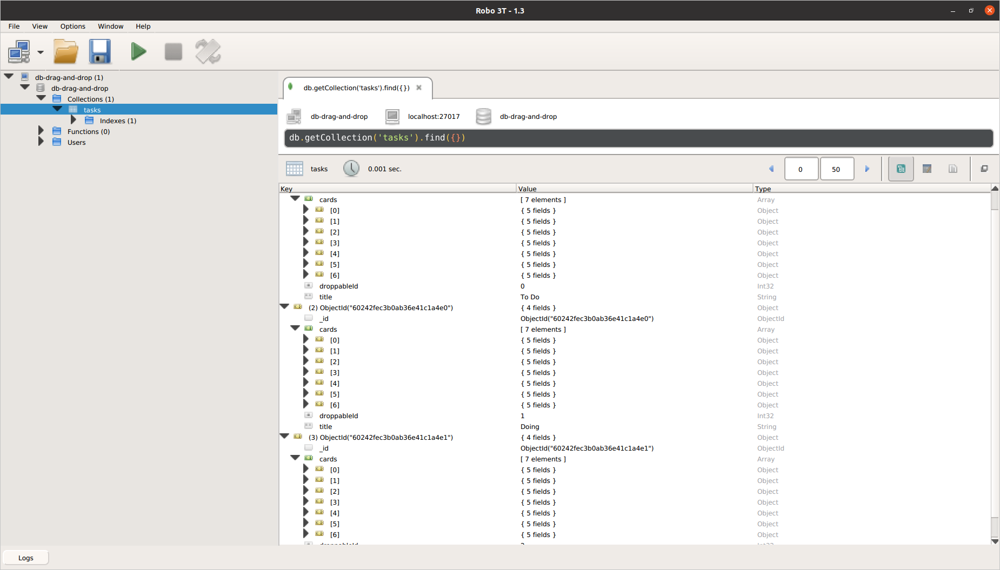

<h1 align="center">Drag And Drop Real Time With Node - React - SocketIO - MongoDB</h1>
<p align="center"> 🚀 A realtime drag and drop with MERN and SOCKE.IO 🚀</p>

<h1 align="center">
  
</h1>


###  Scripts to run the project 

```bash
# Clone this repository
$ git clone <https://github.com/octavioduarte/React-DnD-Node-Socket.git>

# Access the server-side folder 
$ cd server-side/

# Make download of dependencies with yarn (recommended)
$ yarn

# Up a server with mongodb (in this example we will use the docker)
$ docker container run --name <container name> --publish 27017:27017 -d mongo


# Get access into running mongo container bash.
$ docker container exec -it <container name> bash

# Then run mongo by typing following command. it will start the mongo shell.
$ mongo


# Create you desired database with following command.
$ use db-drag-and-drop


# Then create a user to grant privileges to your database.
$ db.createUser({ user: "username", pwd: "password", roles: [] })


# Exit from the mongo shell by typing exit command. now you are on the bash.
$ exit

# Now enable authentication to created database by typing following command on the bash.
$ mongo --port 27017 -u username -p password --authenticatioinDatabase db-drag-and-drop
```

Note: Remembering that just run the container creation script once

________________________________________________________________________________________________


## Create fake data on db


### Still in the server-side directory, execute:

```bash
# This command will populate the database
$ yarn dev:create-fake-data
```

After running you can close the terminal and check if the information has been created

<h1 align="center">
  
</h1>


## Running the socket and http servers

We are now ready to run our Socket and Http servers


```bash
# Running Http server
$ yarn dev:up-server-http

# Running Socket server
$ yarn dev:up-server-socket
```

## Running client-side 


```bash
# Access the clien-side folder 
$ cd client-side/

# Make download of dependencies with yarn (recommended)
$ yarn

# Running the project 
$ yarn start

# Open http://localhost:3000 to view it in the browser.
```

## You can now test the application by connecting different client sockets and watching the drag and drop board updates being performed in real time
